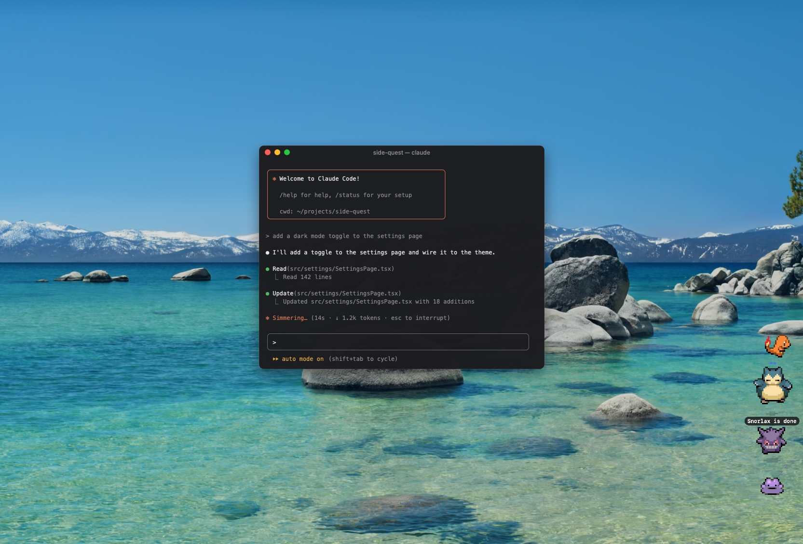
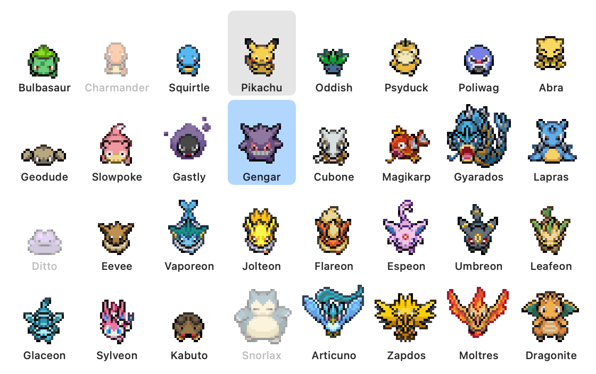

# Claude Agent Pokédex

A pixel Pokemon for every Claude Code session you have running. They float at
the edge of your screen and act out what their agent is doing, so you can tell
at a glance which one is working, which one is waiting on you, and which one
just finished.



| Agent | Pet |
| --- | --- |
| Working | Paces back and forth over a row of dots |
| Needs you (a permission prompt or a question) | Hops and flashes red, like it's taking hits |
| Finished | Jumps for joy over "*Pikachu* is done" until you look at it |
| Idle | Steps in place, then falls asleep with z's drifting up |
| Untouched for 12 hours | Goes back into its Poke Ball |

Each session gets its own Pokemon and keeps it. There are 32 to choose from,
including the starters, Pikachu, Gengar, Snorlax, every Eevee evolution, the
legendary birds and Dragonite.

## Requirements

- macOS 14 or later
- [Claude Code](https://claude.com/claude-code)
- Xcode's command-line tools, to build the app: `xcode-select --install`

## Install

```bash
git clone https://github.com/alfonsokkim/claude-agent-pokedex.git
cd claude-agent-pokedex
./install.sh
```

Or without git: [download the ZIP](https://github.com/alfonsokkim/claude-agent-pokedex/archive/refs/heads/main.zip),
open it, then in Terminal:

```bash
cd ~/Downloads/claude-agent-pokedex-main
zsh install.sh
```

The installer:

1. downloads the sprites (they aren't shipped in this repo, see [Sprites](#sprites))
2. builds `Claude Pet.app` into `~/Applications`
3. adds a `claude-pet` command and a `/pet` command for Claude Code
4. adds a set of hooks to `~/.claude/settings.json` so each session can report
   its status, leaving your other settings exactly as they were
5. starts the app

A pet appears for each Claude Code session as soon as it does something, so
send a message in a session that was already open to see its pet. Run
`./install.sh` again any time, for example after a `git pull`.

## Using it

- **Summon or dismiss** the pets with `claude-pet` in a terminal, or `/pet` in
  Claude Code. To start them when you log in, add **Claude Pet** under System
  Settings → General → Login Items.
- **Click** a pet to jump to its session: it brings that terminal forward, and
  clears the "is done".
- **Drag** a pet anywhere. It stays where you leave it.
- **Hover** over a pet to see which project it belongs to.
- **Right-click** a pet for:
  - **Go to Agent**
  - **Pokemon**: pick a different one from a grid of every sprite. The ones
    other sessions have are greyed out, and picking one swaps the two.
  - **Return to Poke Ball** / **Let Out**: put a pet away by hand. It comes
    back out when you click it or its session gets busy.
  - **Line Up Pets**: a column or a row, in any corner of the screen. Pets are
    spaced by their real size, so a Snorlax gets more room than a Poke Ball.



## How it works

Claude Code runs the app's own binary (`ClaudePet --hook`) in the background on
each hook event: when a session starts, when you send a message, when a tool
runs, when it asks for permission, when it finishes and when it ends. Each run
takes a few milliseconds and writes one small file per session to
`~/.local/share/claude-pet/sessions`, which the app reads once a second.

Pressing Esc to deny a prompt or interrupt a turn doesn't fire a hook, so the
app also checks the end of the session's transcript for the interrupt. A
session that crashes is cleaned up by watching its Claude process.

If you run your agents in [herdr](https://herdr.dev), the pets follow herdr's
sidebar instead: they line up in the same order, and clicking one switches
herdr to that pane.

`~/Applications/Claude Pet.app/Contents/MacOS/ClaudePet --status` lists every
session the pets can see.

## Uninstall

```bash
./install.sh --uninstall
```

This removes the app, the commands, the hooks, the downloaded sprites and the
pets' saved settings. To keep the app but stop the hooks, use
`./install.sh --remove-hooks`.

## Troubleshooting

- **No pets:** make sure the app is running (`claude-pet`), then send a
  message in a Claude Code session so it reports in.
- **A pet is stuck working or flashing:** send that session a message, or
  click the pet; its next hook event puts it right.
- **The build fails:** install or update Xcode's command-line tools with
  `xcode-select --install`, then run `./install.sh` again.

## Project layout

| File | What it is |
| --- | --- |
| `ClaudePet.swift` | The whole app: a single Swift file on AppKit, no dependencies |
| `install.sh` | Install, update and uninstall |
| `build.sh` | Builds the app bundle into `~/Applications` |
| `fetch-sprites.sh` | Downloads the sprites |
| `hooks.js` | Adds or removes the hooks in Claude Code's `settings.json` |
| `claude-pet`, `pet.md` | The toggle command and `/pet` |
| `Info.plist` | The app bundle's metadata |

## Sprites

The Pokemon are Gen 3-style walking sprites from the
[pokeemerald-expansion](https://github.com/rh-hideout/pokeemerald-expansion)
project, and the Poke Ball is FireRed's item ball from
[pret/pokefirered](https://github.com/pret/pokefirered). They're Nintendo and
Game Freak's art, so they aren't included in this repo: `fetch-sprites.sh`
downloads them at install, for personal use.

Pokemon is a trademark of Nintendo, Game Freak and Creatures. Claude is a
trademark of Anthropic. This is a fan project, not affiliated with or endorsed
by any of them.
